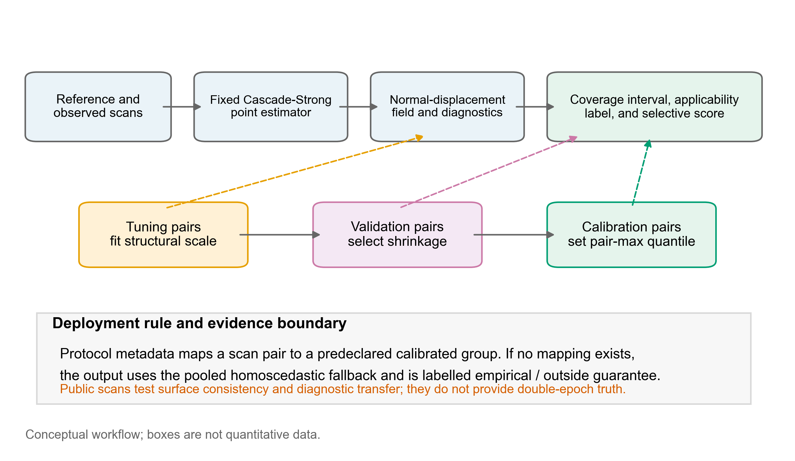
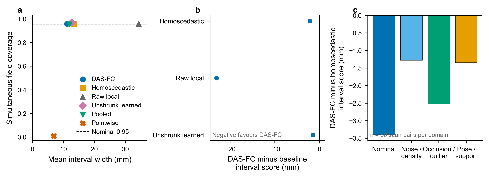
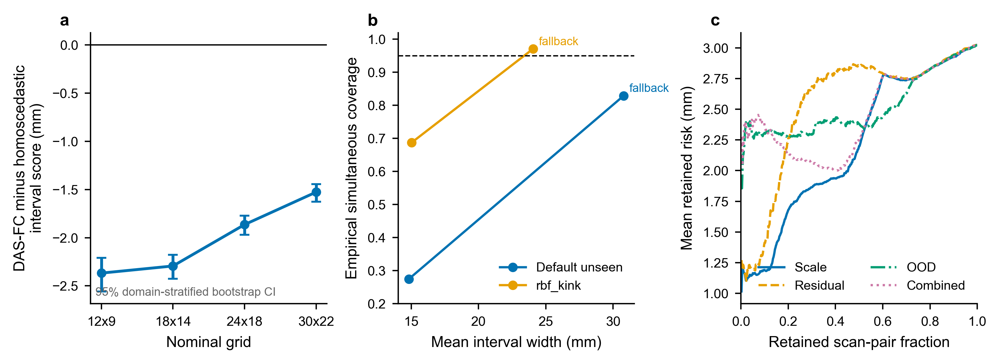
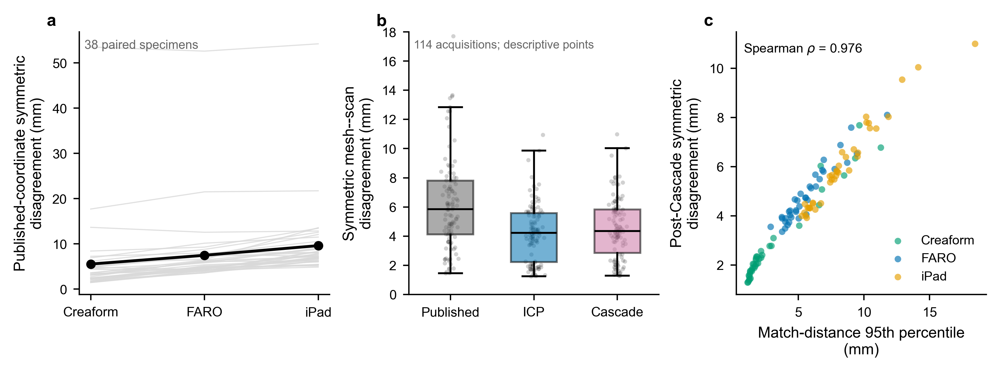
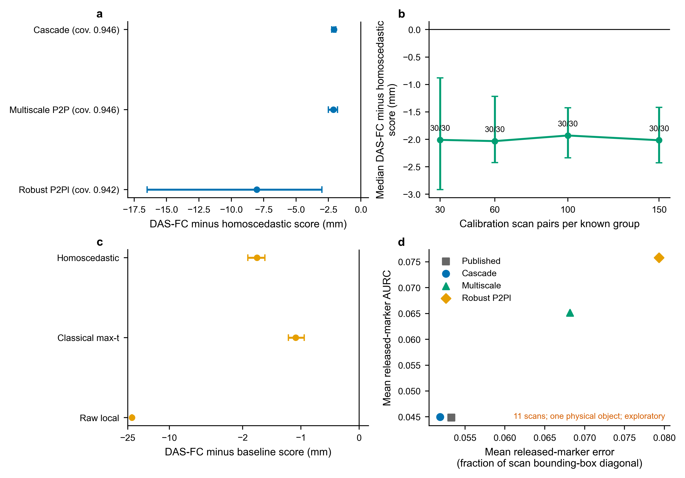
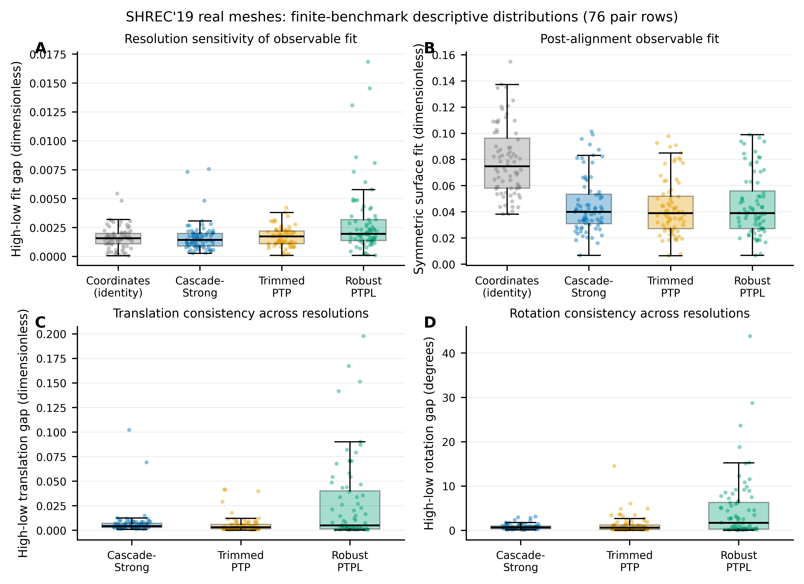
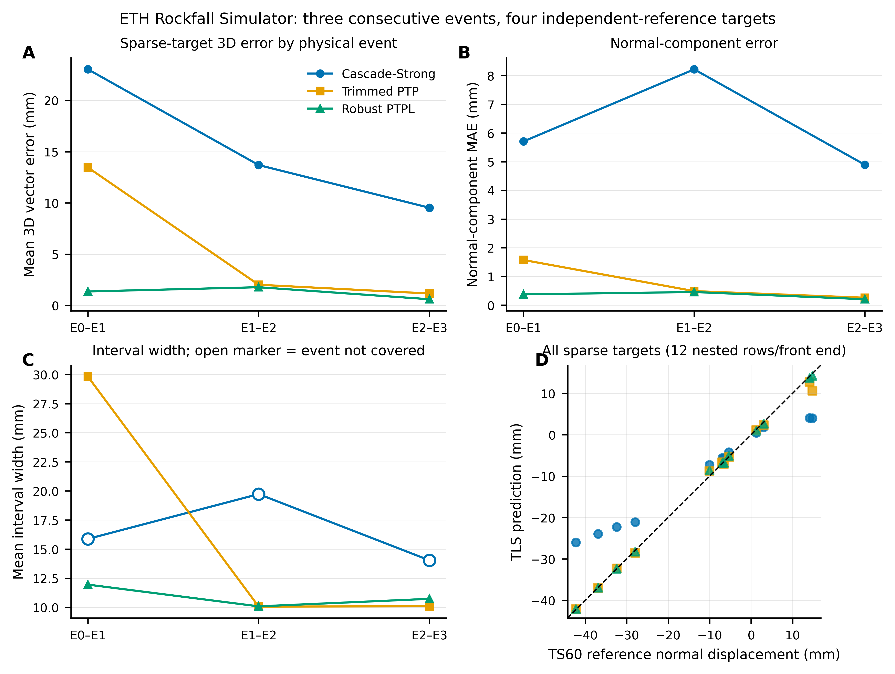

# Scan-pair conformal coverage intervals for structural point-cloud displacement fields

## Abstract

Point-cloud deformation analysis delivers a field, yet coverage is often assessed pointwise. Marginal intervals do not ensure that one scan pair's complete field is covered, and acquisition or geometry shifts can invalidate local error scales. We introduce domain-adaptive shrinkage full-field conformal calibration (DAS-FC), a scan-pair-aligned procedure for simultaneous intervals around a fixed normal-displacement estimator. Separate tuning, validation, and calibration pairs fit a structural scale, select domain-wise shrinkage, and calibrate the maximum standardized field error. Unmapped domains receive a pooled fallback outside the formal guarantee. In 240 held-out pairs from four known synthetic domains, DAS-FC achieved 0.958 simultaneous coverage and reduced mean width from 13.351 to 11.173 mm relative to homoscedastic pair-max calibration. The paired interval-score difference was -2.135 mm (domain-stratified bootstrap 95% confidence interval, -2.362 to -1.939). Pointwise intervals attained 0.946 mean point coverage but covered only 2/240 complete fields. Extensions retained negative score differences across three frozen registration front ends and 120 repeated splits, and beat three comparator bands on 240 pairs. Confirmatory nominal-coverage evidence is therefore synthetic, where dense field truth is observable. Without retuning, three consecutive ETH Rockfall Simulator events supplied a sparse independent-reference check: trimmed point-to-point and robust point-to-plane intervals covered all four referenced targets in 3/3 events, whereas Cascade-Strong did so in 0/3. Robust point-to-plane event-mean 3D errors ranged from 0.609 to 1.781 mm. One apparatus and four targets per event cannot establish dense-field, population-level, or railway-field coverage.

**Keywords:** point cloud; displacement; coverage interval; conformal prediction; calibration; metrology; selective reporting

## 1. Introduction

Repeated three-dimensional scanning can convert structural change into a dense geometric measurement. The resulting product is not one scalar but a displacement field whose locations share the same acquisition, registration, and reconstruction errors. Methods for point-cloud change detection have propagated registration and measurement errors into local significance measures [@winiwarter2021], and dense displacement estimators have enabled field-scale monitoring from successive point clouds [@gojcic2021]. Structural laser-scanning studies also show that registration, segmentation, reference-surface choice, and outlier handling can materially alter the reported deformation [@truong-hong2021]. These developments make interval characterization integral to the reported measurement result rather than an optional visualization layer.

Most uncertainty summaries nevertheless remain local. Position-uncertainty models and adaptive projections quantify how individual points or neighborhoods contribute to deformation estimates [@sun2023], while regional random-field models describe the spatial distribution of point-cloud positional error [@wang2024]. Local intervals answer whether one location is plausible under a model. They do not answer a stricter operational question: for one reference--observation scan pair, does the reported interval cover the true displacement at every predefined valid field location? If a field contains hundreds or thousands of evaluated locations, high marginal point coverage can coexist with almost certain failure somewhere in the delivered field. Treating those locations as independent observations additionally creates pseudoreplication because they share one measurement event.

Registration research addresses other parts of the same chain. Stable-region and piecewise strategies reduce contamination of the rigid transform by actual structural change [@yang2025], and multi-region objectives combine several presumed stable areas [@wang2026]. Probabilistic and learned non-rigid registration methods represent deformation or correspondence uncertainty [@madsen2022; @mei2023], while spatial-consistency networks and confidence calibration improve rigid correspondence selection [@bai2021; @yuan2024]. These components are important, but correspondence confidence, registration dispersion, pointwise positional error, and calibrated displacement-field coverage are different quantities. A stronger registration front end also cannot establish that an uncertainty layer is better unless competing uncertainty methods share the same point estimates.

Conformal methods offer finite-sample calibration by reserving exchangeable calibration examples. Risk-control formulations extend the target beyond marginal prediction error [@angelopoulos2024], functional-output methods construct calibrated bands or covered-fraction guarantees [@ma2024], and dense medical registration has combined quantile estimation with conformal uncertainty at voxel, landmark, and case levels [@gheiji2026]. Exact conditional coverage is not universally available in finite samples, however; practical guarantees require predefined groups, restricted function classes, or explicit shift assumptions [@gibbs2025; @bhattacharyya2026]. For structural point clouds, the calibration unit and the delivered measurement event should therefore be aligned explicitly, and behavior outside represented domains should be reported empirically rather than relabeled as guaranteed.

This study introduces domain-adaptive shrinkage full-field conformal calibration (DAS-FC). The method leaves a fixed support-aware point estimator unchanged across all interval comparisons. It learns a positive structural conditional error scale on tuning scan pairs, selects domain-wise shrinkage toward a homoscedastic scale on separate validation pairs, and calibrates the maximum standardized field error on complete calibration pairs. A conservative fallback and a frozen scan-pair rejector report degradation under domain shift rather than forcing a nominal guarantee. The contribution is the interaction of these elements around a measurement-event-aligned target, not the first use of registration, heteroscedastic regression, shrinkage, or conformal prediction individually.

We evaluated the method in a leakage-controlled synthetic design with known and unseen domains, interval baselines, ablations, independent rejector confirmation, grid sensitivity, deterministic reproduction, and an out-of-basis deformation family. Prospective extensions tested three frozen registration front ends, repeated calibration allocations, and classical reference bands. Public 3DPrintedShapes, released-marker, and SHREC'19 data probed device variation, sparse correspondence, and cross-resolution stability [@dyke2019]. Because these archives lack independently measured double-epoch displacement truth, a frozen ETH Rockfall Simulator study used four Leica TS60 prism targets to reference consecutive Leica RTC360 scan pairs [@wang2025rgb]. The confirmatory claim is limited to scan-pair-aligned simultaneous coverage and interval efficiency in predefined synthetic measurement domains, where dense field truth is observable. Public scans test consistency and failure behavior; Rockfall supplies a sparse independent-reference check rather than dense-field or deployment validation.

## 2. Related work

### 2.1 Structural displacement measurement from point clouds

Point-cloud change measurement spans direct surface comparison, dense correspondence, and structure-specific reconstruction. Error-propagated change detection links point precision and registration covariance to a level of detectable change [@winiwarter2021]. Dense field methods estimate three-dimensional surface motion from successive surveys and have been demonstrated in field settings such as landslides [@gojcic2021]. Structural assessment workflows add segmentation, reference geometry, and engineering interpretation, all of which introduce task-specific error sources [@truong-hong2021]. Recent public structural resources include finite-element-derived deformed steel point clouds [@gu2025] and methods for reconstructing deformed steel members under measurement noise [@gu2026]. These studies establish the value of dense geometry, but they do not make every field location an independent statistical replicate.

### 2.2 Registration, structural priors, and uncertainty

Rigid misalignment and true deformation are coupled. Piecewise-ICP uses stable planar patches to protect rigid registration from changing regions [@yang2025], while multi-region joint registration aggregates several stable areas [@wang2026]. Non-rigid approaches range from Gaussian-process priors [@madsen2022] and neural deformation pyramids [@li2022] to piecewise polynomial transformations that can represent local discontinuities [@glira2023]. Learned rigid methods use geometric consistency [@bai2021], probabilistic correspondence [@mei2023], or calibrated inlier confidence [@yuan2024]. Cross-dataset LiDAR work further shows that registration generalization is itself a distinct problem [@zeng2025].

These methods motivate several components of our fixed estimator and its diagnostics, but their uncertainty targets differ from full-field displacement coverage. A registration distribution characterizes plausible transformations; an inlier probability characterizes correspondence; and a local residual measures agreement after fitting. None alone establishes that all locations of a reported structural displacement field fall within their intervals. We therefore compare uncertainty constructions only after freezing the point estimates.

### 2.3 Conformal calibration for structured outputs and domain shift

Conformal prediction converts held-out nonconformity scores into calibrated prediction sets under exchangeability. Conformal risk control generalizes this idea to bounded losses [@angelopoulos2024], and operator-learning methods have developed calibration for functional outputs [@ma2024]. CONReg demonstrates that conformal calibration can be useful for dense registration fields in another application domain [@gheiji2026]. Our work does not claim that conformal field uncertainty is new. Its distinction is the scan-pair maximum event: every predefined location in one structural measurement field must be covered simultaneously.

Domain conditioning is also bounded by theory. Universal finite-sample conditional coverage is unattainable without restricting the conditioning target [@gibbs2025]. Group-weighted conformal prediction provides a principled route when groups and shift structure are specified [@bhattacharyya2026]. We use predefined known domains for model selection and calibration, and we label held-out-domain outcomes as empirical stress tests. Fallback and abstention are measurement policies for exposing degraded applicability, not devices for restoring a theorem after exchangeability fails.

Metrological vocabulary creates an additional boundary. The International Vocabulary of Metrology defines concepts such as measurand, measurement error, calibration, and measurement uncertainty [@jcgm2002012], while the GUM provides a model-based framework for evaluating and expressing measurement uncertainty [@jcgm1002008]. A split-conformal coverage interval is not automatically a GUM standard or expanded uncertainty. We therefore use *conformal calibration* only for held-out nonconformity scores, reserve *error* for synthetic cases with known truth, and describe the real public endpoint as surface disagreement rather than displacement error.

## 3. Measurement problem and notation

### 3.1 Measurand and coverage event

Let $P_0$ and $P_1$ denote a reference and an observed structural point cloud. Their pairing defines one measurement event. A geometry map fixed before evaluation defines valid surface-field locations $x\in\mathcal{X}$, panel membership $g(x)$, and candidate support regions. The measurand in this study is the normal-displacement field $u(x)$ between the two states at those frozen locations. The point estimator returns $\hat{u}(x)$ together with local matching, fitting, and support diagnostics.

The reported coverage output is a two-sided interval

\[
I(x)=[\hat{u}(x)-w(x),\;\hat{u}(x)+w(x)].
\]

The primary coverage event is not a pointwise event. For scan pair $j$, simultaneous coverage is

\[
C_j=\mathbf{1}\{u_j(x)\in I_j(x)\;\text{for every }x\in\mathcal{X}_j\}.
\]

One $C_j$ contributes one Bernoulli observation. Grid locations within pair $j$ do not increase the independent sample size. We report simultaneous coverage, mean interval width, and the interval score. At nominal coverage $1-\alpha$, the two-sided interval score at one location is

\[
S_{\alpha}(l,r;u)=(r-l)+\frac{2}{\alpha}(l-u)\mathbf{1}\{u<l\}
+\frac{2}{\alpha}(u-r)\mathbf{1}\{u>r\}.
\]

Scan-pair summaries average this score over the frozen valid field. Lower values indicate a better coverage--efficiency balance.

### 3.2 Metrological interpretation

The measurand definition follows the VIM principle that the quantity intended to be measured must be specified [@jcgm2002012]. In the synthetic experiments, $u(x)$ is known and the difference $\hat{u}(x)-u(x)$ is an observable estimation error. In a real double-epoch measurement, the measurand value would be unknown and would require an independent reference system for validation.

The intervals in this paper are conformal coverage intervals for future scan-pair events under stated exchangeability and group-membership conditions. They are not a GUM-derived standard uncertainty, expanded uncertainty, or metrological traceability statement [@jcgm1002008]. The acquisition, registration, support, and reconstruction effects represented in the simulator act as influence quantities in the measurement model, but the study does not claim a complete physical uncertainty budget. This distinction is why the public single-state endpoint is called *surface disagreement* rather than displacement error.

### 3.3 Protocol-defined applicability

Known calibration domains are acquisition or degradation groups declared before measurement and represented in tuning, validation, and calibration. A deployment protocol must map scanner and acquisition metadata to one of these registered groups without using displacement truth. If no registered mapping exists, the pair is outside the calibrated scope and receives the pooled homoscedastic fallback plus an explicit empirical-applicability label. An unseen domain is therefore a protocol status, not a visual judgment made after observing test error. The distinction concerns calibration eligibility, not whether a case appears visually unusual.

## 4. DAS-FC method

Figure 1 separates the three data roles from the test-time output. Tuning pairs fit the local scale, validation pairs select shrinkage and freeze selective-score normalization, and calibration pairs set the pair-maximum quantile. No test-pair truth enters these steps.

**Figure 1. DAS-FC workflow and applicability boundary.** A fixed point estimator produces the displacement field and diagnostics. Independent tuning, validation, and calibration roles fit the structural scale, select shrinkage, and set the scan-pair maximum quantile. Protocol metadata must map a new pair to a predeclared calibrated group; otherwise, the pooled homoscedastic fallback is reported outside the formal guarantee. The public three-device analysis supplies consistency evidence only and is not part of the displacement-coverage calibration chain.

### 4.1 Shared support-aware point-estimation front end

Cascade-Strong is held fixed across all interval methods. It initializes translation from the midpoints of the 10th and 90th coordinate percentiles, then performs 14 trimmed point-to-point ICP iterations using geometry-derived candidate supports. At each iteration, the nearest-match gate retains the lowest 82% of eligible distances and robust weights limit residual influence. The aligned normal coordinates are fitted separately within each panel using a nine-term basis (constant, linear, quadratic, interaction, and three sinusoidal terms), ridge penalty $10^{-2}$, and four robust reweighting passes. The raw local scale combines a 20-neighbour median absolute residual, 0.20 times the match distance, and a 0.35 mm floor. Candidate supports may be contaminated or missing; the estimator never receives the synthetic ground-truth support mask.

The front end returns $\hat{u}(x)$, raw local scale, nearest-match distance, support probability, validity mask, and convergence diagnostics. DAS-FC, homoscedastic pair-max, raw-local pair-max, learned-unshrunk pair-max, pooled calibration, no-fallback, and pointwise calibration all use this same $\hat{u}(x)$. Consequently, differences in coverage, width, or interval score cannot be attributed to a more accurate point estimator.

### 4.2 Structural conditional error scale

A dedicated tuning split fits a positive scale from no more than 256 valid locations sampled deterministically per scan pair. Every pair has total sample weight one, so dense fields do not dominate tuning. The seven features are log raw-local scale, log-one-plus match distance, support probability, absolute predicted displacement, two panel-local coordinates, and normalized panel index. The response is

\[
y(x)=\log(|u(x)-\hat{u}(x)|+0.10\ \mathrm{mm}).
\]

The implementation uses `HistGradientBoostingRegressor` with quantile loss at 0.80, learning rate 0.06, 160 iterations, 15 leaf nodes, minimum 30 samples per leaf, $L_2$ regularization 1.0, and random state 20260719. Exponentiated predictions are floored at 0.10 mm to produce $s_{\mathrm{ml}}(x)$. Location samples train the scale model, but they are never treated as independent units in coverage inference.

### 4.3 Validation-only domain-adaptive shrinkage

An unconstrained learned scale may become variable when a domain has limited tuning data. For each protocol-defined known domain $d$, DAS-FC shrinks $s_{\mathrm{ml}}(x)$ toward the scan-pair median raw scale $s_{\mathrm{homo}}$:

\[
s_{\mathrm{DAS}}(x;d)=\exp\{(1-\lambda_d)\log s_{\mathrm{homo}}+\lambda_d\log s_{\mathrm{ml}}(x)\}.
\]

The coefficient $\lambda_d$ is selected from $\{0,0.25,0.50,0.75,1.00\}$ using only validation pairs. For each candidate, validation pairs are pair-max calibrated and the objective $2q_{d,\lambda}\,\overline{s}_{d,\lambda}$ estimates mean interval width. The smallest objective is selected, with smaller $\lambda$ breaking exact ties. The coefficient is then frozen. Calibration and test truth cannot change it. The learned-unshrunk baseline fixes $\lambda=1$, whereas the homoscedastic baseline fixes $\lambda=0$.

### 4.4 Scan-pair maximum conformal calibration

For calibration pair $j$ in known domain $d$, the nonconformity score is

\[
R_j=\max_{x\in\mathcal{X}_j}
\frac{|u_j(x)-\hat{u}_j(x)|}{\max\{s_{\mathrm{DAS},j}(x),10^{-6}\}}.
\]

If domain $d$ contains $n_d$ calibration pairs, the order index is

\[
k_d=\min\left\{n_d,\left\lceil(n_d+1)(1-\alpha)\right\rceil\right\}.
\]

The $k_d$-th ordered score defines $q_d$, and $w(x)=q_d s_{\mathrm{DAS}}(x;d)$. With 150 calibration pairs per known domain and $\alpha=0.05$, $k_d=144$. If the calibration scores and a future pair are exchangeable within the protocol-defined group, and all scale/shrinkage choices were fixed before calibration, the usual split-conformal rank argument gives simultaneous coverage of the complete frozen field at the finite-sample level implied by this quantile. The statement does not apply after an unregistered domain shift. Pointwise conformal instead pools location scores and is included as a negative control.

### 4.5 Unseen-domain fallback and selective reporting

When protocol metadata do not map a pair to a calibrated group, DAS-FC does not estimate a new shrinkage coefficient from test error. It fixes $\lambda=0$ and uses the pooled homoscedastic calibration quantile. The resulting coverage is reported empirically without a formal 0.95 claim.

Selective reporting ranks complete scan pairs by diagnostics available without displacement truth: mean full-field scale, median nearest-match distance, and the root-mean-square standardized distance of seven scan diagnostics from their tuning means. A combined score takes their maximum after validation-only median/MAD normalization. If $e_{(i)}$ is scan-pair normal-displacement MAE after ordering by increasing rejection score, selective risk at retention $m/n$ is $m^{-1}\sum_{i=1}^{m}e_{(i)}$; AURC is its trapezoidal integral. The original combined rejector failed in formal v1 and is retained as a negative ablation. The scale-only rule was frozen and tested once on disjoint v2 data.

### 4.6 Executable algorithm

**Algorithm 1: DAS-FC training, calibration, and inference.**

1. Freeze the field geometry, point estimator, valid-location rule, domain metadata schema, and disjoint tuning/validation/calibration/test case IDs.
2. Run the shared estimator on tuning pairs. Sample at most 256 valid locations per pair, give each pair total weight one, and fit the 0.80-quantile log-error scale model described in Section 4.2.
3. For each predeclared domain $d$ and every $\lambda\in\{0,0.25,0.50,0.75,1\}$, compute validation pair-maximum scores and the estimated mean width $2q_{d,\lambda}\overline{s}_{d,\lambda}$. Freeze the minimizing $\lambda_d$, breaking exact ties toward the smaller value.
4. Recompute scores on the untouched calibration pairs with all preceding choices frozen. Store the $k_d$-th score, where $k_d=\min\{n_d,\lceil(n_d+1)(1-\alpha)\rceil\}$, as $q_d$. Separately store the pooled homoscedastic fallback quantile and validation-only rejector normalization.
5. At inference, map acquisition metadata to a registered domain. If a mapping exists, return $\hat u(x)\pm q_d s_{\mathrm{DAS}}(x;d)$ with an in-scope label. Otherwise return the pooled homoscedastic fallback with an outside-guarantee label.
6. Report convergence, valid-location count, interval width, applicability status, and frozen selective score. Never use test-pair error to select a domain, scale, shrinkage coefficient, quantile, or rejector.

## 5. Experimental design

### 5.1 Leakage-controlled synthetic benchmark

The independent unit was a complete synthetic scan pair defined by structure geometry, deformation case, observation domain, and generator seed. Four known domains represented nominal acquisition, noise/density degradation, occlusion/outliers, and pose/support degradation. Each known domain contained 60 tuning, 40 validation, 150 calibration, and 60 formal test pairs. Thus the known-domain formal test contained 240 pairs. Four unseen stress domains represented compound extreme degradation, pose extrapolation, support failure, and geometry/amplitude extrapolation, with 60 test pairs each. Seed families for every role were disjoint.

The default deformation generator combined panel-wise modal deflection, local bulging, joint slip, and rigid installation offsets. Observation generation varied distance- and geometry-dependent noise, density, dropout, occlusion, outliers, coordinate jitter, pose error, and support-candidate contamination. All coordinates and outcomes were expressed in millimetres.

The primary contrast compared DAS-FC with homoscedastic pair-max calibration under identical point estimates. Secondary confirmatory contrasts used raw-local and learned-unshrunk pair-max calibration. Additional baselines included pooled calibration, no fallback, and pointwise marginal calibration. We reported simultaneous coverage, Wilson confidence intervals, mean interval width, interval score, normal-displacement error, convergence, runtime, and selective-risk AURC.

### 5.2 Statistical analysis

The three interval-score contrasts were paired at scan-pair level and adjusted with Holm's procedure. The primary mean difference used a domain-stratified bootstrap with 10,000 repetitions and a paired sign-flip test with 50,000 randomizations. Paired Cohen's $d_z$, a paired $t$-test, and Wilcoxon signed-rank test were reported as complementary summaries. Because the primary differences were strongly non-normal, inference did not rely on the $t$-test alone. Simultaneous coverage uncertainty used Wilson intervals. No point or grid location was used as a statistical replicate.

The planned known-domain sample size was 240. Under a two-sided familywise level of $0.05/3$, this design had estimated power 0.927 for a paired standardized effect of 0.25; the required sample sizes for effects of 0.25, 0.35, and 0.50 were 220, 114, and 57, respectively.

### 5.3 Independent rejector confirmation and sensitivity analyses

Formal v1 was used only to select the already implemented scale-only rejector after the combined score failed. A new protocol then evaluated scale, residual, out-of-domain, and combined scores on 480 fresh scan pairs with no case-ID overlap with v1. Domain-stratified bootstrap intervals compared scale AURC against each alternative.

Grid sensitivity repeated the complete pipeline at 12x9, 18x14, 24x18, and 30x22 nominal grids using new seed families. A separate deformation-family stress test generated 240 `rbf_kink` cases. This family combined anisotropic radial-basis bumps, a one-sided hinge, a higher-frequency asymmetric ripple, and tapered offsets; these functions were absent from the estimator basis. The scale model, shrinkage coefficients, quantiles, fallback, and rejector remained frozen.

### 5.4 Public three-device point clouds

3DPrintedShapes v1 contains 38 physical printed specimens, digital meshes, and acquisitions from iPad/Scaniverse, FARO Focus, and Creaform HandySCAN3D [@gu2026printed]. The 5,270,430,109-byte archive passed its published MD5 and a local SHA-256 check. The audit read 38 meshes and 228 raw/processed point-cloud representations; representations from one acquisition were not treated as independent.

The real-data endpoint was single-state symmetric mesh--scan surface disagreement. We compared published processed coordinates, multiscale point-to-point ICP, and unmodified Cascade-Strong on all 114 device acquisitions. Bootstrap resampling used the 38 physical specimens as clusters. These data have no common undeformed state and no double-epoch displacement truth; they therefore cannot evaluate DAS-FC displacement accuracy or conformal coverage.

### 5.5 Prospective robustness extensions

Four extensions were frozen before execution. P0b compared four front ends on 11 released-marker scan pairs from one SHREC2020A deformable object using sparse correspondence error and selective-risk AURC; it permitted no independent-object or coverage inference.

P1 reran the shared synthetic protocol with Cascade-Strong, multiscale trimmed point-to-plane, and robust point-to-plane front ends on the same 480 test pairs. Its gate required negative DAS-FC-minus-homoscedastic effects for all three, confidence intervals below zero for at least two, coverage at least 0.90, and zero failures.

P2 reassigned one frozen trajectory pool 30 times at calibration sizes 30, 60, 100, and 150 per known group. Its gate required at least 27/30 negative effects, a negative 2.5--97.5% stability interval, coverage above 0.90, and zero failures. These are split-sensitivity analyses, not independent experiments.

P3 compared DAS-FC with homoscedastic pair-max, classical two-stage max-t, and raw-local pair-max bands on 240 fresh-seed known-domain pairs with identical point estimates. Paired contrasts used domain-stratified bootstrap intervals, sign-flip tests, and Holm adjustment. Runs were serial, stopped on failure, and not overwritten.

### 5.6 Public SHREC'19 real-deformation stress test

SHREC'19 comprises real scans under controlled articulation, bending, stretching, and topology-changing deformation [@dyke2019]. Its 61,587,401-byte archive passed SHA-256 verification and contained 50 scan identifiers at high and low resolutions. Deduplication removed one repeated row, yielding 76 unique graph edges across four test sets. Because scan identifiers recur, specimen independence is undocumented, and native units are unspecified, pair rows were not treated as independent physical specimens and no population confidence interval or hypothesis test was computed. The retrieved public archive contained no correspondence or displacement-reference files, so none was reconstructed or inferred.

Published coordinates and three registration front ends were applied to both resolutions and directions of every pair. A common centre and robust diagonal from the combined high-resolution pair normalized all representations. Co-primary descriptive endpoints were high--low gaps in symmetric surface fit, normalized translation, and rotation; secondary diagnostics included cycle defects, strata, Spearman associations, and leave-one-scan-ID-out ranges. Published coordinates were an identity negative control and were not ranked on transform or cycle gaps.

### 5.7 ETH Rockfall Simulator sparse independent-reference check

The ETH Rockfall Simulator provides four successive Leica RTC360 scans of a controlled rock slope and Leica TS60 prism observations [@wang2025rgb]. We froze CC BY 4.0 revision `42a3947d960c8163157c915dea847cda96904a3d`. A preregistered five-target frame mapping used stable target T0 without algorithm outputs. Across epochs, mapping root-mean-square residuals were 1.809--2.119 mm, maxima were 2.440--3.639 mm, and T0 TLS drift was 1.952 mm; these values were not subtracted from displacement errors.

Three consecutive physical events were processed once with the frozen front ends. Estimator, fallback quantiles, thresholds, and P1 reports were hash-locked; no Rockfall case was used for tuning or calibration. Unmapped acquisition metadata triggered the predeclared fallback and an outside-guarantee label. Endpoints were event-level coverage of four TS60-referenced normal components, 3D target error, normal MAE, width, and score. The scan-pair event was independent; the four targets were nested validation locations, so no target-level inference was used.

### 5.8 Reproducibility

Experiments used isolated CPython 3.12.3 and a hashed dependency lock. The 24-core CPU pipeline did not use the available GPU. A deterministic rerun matched configuration, seeds, calibration state, all 3,360 method-level scientific rows, 480 rejector rows, summaries, and AURCs after excluding duration fields; two independent 1,216-row executions matched exactly for SHREC'19 after excluding timestamps, durations, and resolved paths. Rockfall ran in non-overwriting directories after source, calibration, dataset-revision, and predecessor-gate checks; manifests passed SHA-256 verification and preserved the first failed CSV-writing attempt.

The complete implementation parameters, calibration order, operational domain rule, selective-risk definition, SHREC'19 protocol, Rockfall reference protocol, and reproducibility contract are provided in Supplementary Methods S1--S10.

## 6. Results

### 6.1 DAS-FC improved known-domain interval efficiency

DAS-FC achieved simultaneous coverage of 230/240, or 0.958 (Wilson 95% confidence interval, 0.925--0.977). Its mean interval width was 11.173 mm and mean interval score was 11.218 mm. Homoscedastic pair-max calibration achieved coverage 0.954 with width 13.351 mm and score 13.353 mm. Thus the DAS-FC gain was not obtained by widening intervals.

The primary paired DAS-FC-minus-homoscedastic interval-score difference was -2.1348 mm (domain-stratified bootstrap 95% confidence interval, -2.3617 to -1.9394). The paired standardized effect was $d_z=-1.136$, with $t(239)=-17.599$, Holm-adjusted $p=1.00\times10^{-44}$, and sign-flip $p=2.00\times10^{-5}$. The difference distribution was left-skewed (skewness -3.046; Shapiro--Wilk $p=6.58\times10^{-22}$); the bootstrap, sign-flip, and signed-rank conclusions agreed with the parametric test.

All four known domains favored DAS-FC. Mean score differences were -3.397 mm in nominal, -1.278 mm in noise/density, -2.521 mm in occlusion/outlier, and -1.344 mm in pose/support. DAS-FC also improved interval score relative to raw-local pair-max by -23.0478 mm (95% confidence interval, -23.3465 to -22.7705; $d_z=-2.893$) and relative to learned-unshrunk pair-max by -1.4513 mm (-1.5557 to -1.3341; $d_z=-0.894$). The latter isolates the contribution of validation-selected shrinkage from the same structural scale learner.

Table 1 summarizes the known-domain coverage and efficiency results for all interval constructions sharing the same point estimates.

| Method | Simultaneous coverage | Mean width (mm) | Mean interval score (mm) |
|---|---:|---:|---:|
| DAS-FC | 0.958 | 11.173 | 11.218 |
| Homoscedastic pair-max | 0.954 | 13.351 | 13.353 |
| Raw-local pair-max | 0.958 | 34.262 | 34.266 |
| Learned-unshrunk pair-max | 0.971 | 12.637 | 12.669 |
| Pooled pair-max | 0.954 | 11.968 | 11.998 |
| Pointwise conformal | 0.008 | 6.903 | 8.043 |

**Figure 2. Primary known-domain results.** (a) Simultaneous field coverage versus mean interval width for six interval constructions sharing identical point estimates; the dashed line marks 0.95. (b) Paired DAS-FC-minus-baseline interval-score differences with domain-stratified bootstrap 95% confidence intervals. (c) DAS-FC-minus-homoscedastic interval-score differences in each known domain ($n=60$ scan pairs per domain). Negative differences favour DAS-FC.

### 6.2 Pointwise calibration did not cover complete fields

Pointwise conformal intervals had mean point coverage 0.946, which appears close to the nominal 0.95 target when locations are viewed separately. Only 2 of 240 complete fields were simultaneously covered, corresponding to 0.0083 (Wilson 95% confidence interval, 0.0023--0.0299). The negative control demonstrates that marginal point calibration cannot be substituted for a scan-pair simultaneous claim.

### 6.3 Independent v2 confirmed scale-only selective ranking

The original combined rejector failed in formal v1: its AURC was 2.4100 compared with 2.2056 for scale-only, and combined minus scale was +0.204 (bootstrap 95% confidence interval, +0.173 to +0.236). This hypothesis was not retained as a positive contribution.

On 480 disjoint v2 scan pairs, scale-only AURC was 2.2115, compared with 2.5359 for residual-only, 2.5152 for out-of-domain-only, and 2.4686 for the failed combined score. Scale minus comparator bootstrap intervals were -0.374 to -0.280 for residual, -0.346 to -0.264 for out-of-domain, and -0.287 to -0.228 for combined. The fresh test therefore confirmed the simplified selective-risk ranking under the tested synthetic domains.

### 6.4 Grid resolution did not determine the primary effect

All four grid variants, evaluated with a seed family disjoint from formal v1, passed their frozen coverage, score, and normalized-width gates. Known-domain simultaneous coverage ranged from 0.950 to 0.971. DAS-FC-minus-homoscedastic score differences were -2.367, -2.293, -1.864, and -1.527 mm for 12x9, 18x14, 24x18, and 30x22, respectively; every bootstrap confidence interval remained below zero. Normalized mean-width ratios relative to the 18x14 reference ranged from 0.934 to 1.000. No method row failed to converge.

### 6.5 Unseen domains exposed a coverage--efficiency trade-off

Across the four default unseen stress domains, frozen homoscedastic fallback increased empirical simultaneous coverage from 0.275 without fallback to 0.829. Mean width increased from 14.828 to 30.789 mm, however, and interval score worsened from 17.675 to 30.984 mm. Fallback therefore recovered many complete fields at a substantial efficiency cost and did not establish nominal 0.95 coverage.

The distinct `rbf_kink` deformation family produced a mean normal-displacement MAE of 1.590 mm with zero non-convergence among 240 scan pairs. Fallback coverage was 0.971 (Wilson 95% confidence interval, 0.941--0.986), compared with 0.688 without fallback. The paired coverage difference was +0.283 (bootstrap 95% confidence interval, +0.225 to +0.342). Mean width increased by 9.022 mm, and interval score worsened by 8.927 mm (8.564 to 9.366). The point estimator transferred to functions outside its fitted basis, but the interval policy again exhibited a coverage--efficiency trade-off.

On this deformation-family stress set, scale-only AURC was 1.4946 and residual-only AURC was 1.4822; their difference interval crossed zero (-0.0090 to +0.0327). Scale remained better than the out-of-domain and combined diagnostics. Accordingly, the independent v2 conclusion is not generalized into a universal real- or arbitrary-family ordering.

**Figure 3. Sensitivity and robustness boundaries.** (a) DAS-FC-minus-homoscedastic interval-score differences across four grids, with domain-stratified bootstrap 95% confidence intervals. (b) Empirical coverage and mean width with and without frozen fallback in the default unseen and `rbf_kink` stress sets; these are stress-test outcomes, not nominal guarantees. (c) Selective-risk curves on 480 disjoint v2 scan pairs; lower risk at a given retained fraction is preferred.

### 6.6 Public scans demonstrated device-domain shift and a negative transfer boundary

Without hidden registration, mean mesh--scan disagreement was 9.622 mm for iPad/Scaniverse, 7.491 mm for FARO Focus, and 5.551 mm for Creaform HandySCAN3D. The strict Creaform < FARO < iPad ordering occurred in 33 of 38 specimens. A repeated-measures Friedman test gave $\chi^2=63.0$ with Kendall's $W=0.829$, indicating a strong device-associated gradient within the public corpus.

Multiscale ICP reduced mean symmetric disagreement to 4.222 mm, whereas unmodified Cascade-Strong obtained 4.539 mm. Cascade minus ICP was +0.316 mm (specimen-cluster bootstrap 95% confidence interval, +0.185 to +0.476). The fixed front end transferred without non-convergence and improved on published coordinates, but it was not a state-of-the-art real registration method.

All frozen diagnostics were associated with post-Cascade surface disagreement. Mean local scale, scale 95th percentile, and match-distance 95th percentile had Spearman correlations of 0.858, 0.904, and 0.976, respectively. Their AURCs were 2.972, 2.937, and 2.859. Mean-scale minus match-distance AURC was +0.113 (cluster bootstrap 95% confidence interval, +0.070 to +0.161), so match distance ranked real acquisition risk better than learned scale. This negative result prevents a universal scale-only claim.

**Figure 4. Public three-device single-state evidence.** (a) Mesh--scan surface disagreement for 38 paired physical specimens before hidden registration. Lines connect devices within a specimen. (b) Surface disagreement after published coordinates, multiscale ICP, and unmodified Cascade-Strong across 114 acquisitions. (c) Match-distance 95th percentile versus post-Cascade surface disagreement; Spearman $\rho=0.976$. This figure contains no double-epoch displacement truth and cannot validate displacement accuracy or conformal coverage.

### 6.7 Prospective extensions supported frontend, split, and baseline robustness

The P1 effect retained its expected negative sign under all three frozen front ends. DAS-FC-minus-homoscedastic interval-score differences were -2.080 mm for Cascade-Strong (bootstrap 95% confidence interval, -2.250 to -1.936), -2.117 mm for multiscale trimmed point-to-plane (-2.510 to -1.808), and -8.037 mm for robust point-to-plane (-16.503 to -3.001). Known-domain simultaneous coverage was 0.946, 0.946, and 0.942, respectively, with zero failures. The robust point-to-plane interval was substantially wider (mean width 30.553 mm) and its effect interval was broad; this is evidence that the effect sign survived the frontend change, not that this frontend was operationally superior.

All four P2 calibration sizes produced the expected negative effect in 30/30 repeated allocations. Median effects ranged from -2.032 to -1.930 mm. Their 2.5--97.5% stability intervals were [-2.916, -0.880] at 30 pairs, [-2.422, -1.215] at 60, [-2.337, -1.424] at 100, and [-2.426, -1.417] at 150. Median simultaneous coverage ranged from 0.948 to 0.971, and every coverage stability interval remained above 0.90. These results support split and calibration-size stability within one frozen trajectory pool, not 30 independent replications.

In P3, DAS-FC improved interval score relative to homoscedastic calibration by -1.755 mm (95% confidence interval, -1.910 to -1.620), relative to classical max-t by -1.088 mm (-1.214 to -0.941), and relative to raw-local calibration by -22.798 mm (-23.027 to -22.581). All three Holm-adjusted paired-test values were at most $4.66\times10^{-22}$, and the grouped DAS-FC coverage was 0.963 with a mean width of 11.160 mm and zero failures.

The P0b marker benchmark remained deliberately bounded. Mean released-marker error, expressed as a fraction of the full-scan bounding-box diagonal, was 0.0533 for published coordinates, 0.0519 for Cascade-Strong, 0.0682 for multiscale registration, and 0.0793 for robust point-to-plane registration; corresponding mean AURCs were 0.04484, 0.04497, 0.06514, and 0.07581. The 11 pairs came from one physical object and provided sparse correspondence evidence rather than dense truth, independent-object inference, or real sound-barrier validation.

**Figure 5. Prospective robustness extensions.** (a) P1 DAS-FC-minus-homoscedastic interval-score effects under three frozen front ends; horizontal bars are bootstrap 95% confidence intervals and labels give observed known-domain simultaneous coverage. (b) P2 median effects and 2.5--97.5% stability intervals across 30 repeated allocations at each calibration size; labels show negative-effect counts. The repetitions reuse one frozen trajectory pool. (c) P3 paired effects against three predeclared baselines on 240 fresh-seed scan pairs; bars are domain-stratified bootstrap 95% confidence intervals, all Holm-adjusted $p\leq4.66\times10^{-22}$, and the horizontal axis is symmetric-log scaled. (d) P0b released-marker error versus AURC for 11 repeated scans of one physical object. Panel (d) is exploratory and contains neither dense displacement truth nor independent structures.

Table 2 records the evidence gates and the inference allowed by each extension.

| Package | Independent unit | Formal sample | Frozen criterion | Observed result | Gate | Allowed inference |
|---|---|---:|---|---|:---:|---|
| P0b public marker supplement | One physical object | 11 scan pairs, 4 front ends | Complete marker report; no confirmatory coverage gate | 44/44 pair--frontend rows; zero failures | n/a | Exploratory released-marker correspondence and failure behavior only |
| P1 frontend robustness | Shared synthetic scan pair | 3 front ends x 480 test pairs; gate on 240 known pairs/frontend | 3 negative effects; at least 2 CIs below zero; all coverage >=0.90; zero failures | 3/3 negative, 3/3 CIs below zero; coverage 0.942--0.946 | PASS | Effect-sign and coverage robustness to the three frozen front ends |
| P2 repeated splits | Allocation of one frozen trajectory pool | 30 allocations x 4 calibration sizes | At least 27/30 negative; negative stability interval; coverage >0.90; zero failures | 30/30 negative at every size; all stability gates passed | PASS | Split and calibration-size sensitivity, not independent replication |
| P3 classical baselines | Fresh synthetic scan pair | 240 known-domain pairs | Three negative paired effects after multiplicity control; coverage/efficiency gate; zero failures | Effects -1.755, -1.088, and -22.798 mm; grouped coverage 0.963 | PASS | Efficiency relative to three predeclared reference bands under identical point estimates |

### 6.8 Real-deformation meshes exposed a mixed cross-resolution robustness boundary

All 1,216 frozen SHREC'19 method--resolution--direction rows completed without failure. Across 76 pair rows, the median high--low surface-fit gap was 0.001419 for Cascade-Strong (interquartile range, 0.000909--0.002001), 0.001729 for trimmed point-to-point ICP (0.001110--0.002199), and 0.001950 for robust point-to-plane ICP (0.001371--0.003183). Cascade-Strong had the lower pairwise fit gap in 46/76 comparisons with trimmed point-to-point ICP and 59/76 with robust point-to-plane ICP. The ordering was not universal: in test set 0, the median Cascade-minus-trimmed-ICP gap was +0.000110, opposite to the aggregate median of -0.000079.

The same experiment did not support registration superiority. Cascade-Strong's median translation and rotation gaps were 0.004193 and 0.633 degrees, respectively, compared with 0.003010 and 0.591 degrees for trimmed point-to-point ICP and 0.004875 and 1.670 degrees for robust point-to-plane ICP. Median post-alignment symmetric fit was also slightly higher for Cascade-Strong (0.039872) than for trimmed point-to-point ICP (0.038885) or robust point-to-plane ICP (0.038938). For Cascade-Strong, the descriptive association between match-distance 95th percentile and fit-gap instability was $\rho=0.357$; no inferential $p$-value was calculated. Across 44 leave-one-scan-ID-out analyses, its median fit gap ranged from 0.001402 to 0.001573 and its median translation gap from 0.003800 to 0.004859. Thus the real-deformation evidence supports a bounded cross-resolution stress result and identifies frontend-dependent failures; it does not establish correspondence accuracy, displacement accuracy, or conformal coverage.

**Figure 6. SHREC'19 real-deformation cross-resolution stress test.** (a) Absolute high--low gap in symmetric mean surface fit for the identity control and three registration front ends. (b) Post-alignment symmetric surface fit. (c,d) High--low translation and rotation gaps for the three estimating front ends; the identity control is omitted because both gaps are zero by construction. Boxes show medians and interquartile ranges, whiskers use the 1.5-interquartile-range rule, and every one of the 76 pair rows is overlaid. The graph edges are not assumed to be 76 independent physical specimens; no population confidence interval, significance mark, or truth-referenced accuracy is shown.

### 6.9 Sparse independent references exposed strong front-end dependence

All nine frozen Rockfall event--frontend executions converged. Robust point-to-plane and trimmed point-to-point intervals simultaneously covered all four TS60-referenced normal components in 3/3 events, whereas Cascade-Strong covered two, two, and three targets and therefore achieved 0/3 simultaneous events. These are exact finite-sequence counts, not estimates of population coverage.

Robust point-to-plane had the smallest event-level 3D error: median event-mean error was 1.366 mm (range, 0.609--1.781 mm), compared with 2.021 mm (1.167--13.453 mm) for trimmed point-to-point and 13.692 mm (9.532--23.026 mm) for Cascade-Strong. Median normal-component MAE was 0.376, 0.490, and 5.708 mm, respectively. Median interval width was 10.734 mm for robust point-to-plane, 10.091 mm for trimmed point-to-point, and 15.882 mm for Cascade-Strong. The E0--E1 trimmed point-to-point interval widened to 29.815 mm while retaining coverage, illustrating that finite-case coverage alone does not establish efficiency or a universal frontend ranking.

**Figure 7. ETH Rockfall Simulator sparse physical reference study.** (a) Mean 3D vector error at four Leica TS60 reference targets for each consecutive physical event. (b) Normal-component MAE. (c) Mean normal-component interval width; open markers denote failure to cover all four targets in that event. (d) Predicted versus referenced normal displacement for all 12 nested target--event rows per front end. The dashed line is equality. The independent reporting unit is the scan-pair event ($n=3$); targets are nested validation locations. No significance marks, population confidence intervals, dense-field truth, or calibrated three-dimensional vector regions are shown.

### 6.10 Runtime and deterministic reproduction

Point estimation required a mean 0.208 s per scan pair on the cloud CPU, with median 0.221 s, 95th percentile 0.250 s, and maximum 0.272 s, excluding data loading and the graphical interface. The monitored full 18x14 pipeline peaked at 228.238 MiB resident memory. Formal v1 contained 3,360 finite method rows with zero non-convergence.

The deterministic rerun reproduced all scientific outputs exactly after excluding duration fields. The original and rerun canonical SHA-256 were both `a9503bfa6791da55326c1650fd2d565463bd04dae893ee1732738312b08c7d26`.

## 7. Discussion

### 7.1 Calibration should match the delivered measurement event

The central result is not merely that one scale model produced narrower intervals. It is that the calibration unit, test unit, and claimed coverage event were aligned. A user receives one displacement field from one scan pair. The pointwise negative control showed why a marginal statement is insufficient: 0.946 average point coverage translated into only 0.008 whole-field coverage. Pair-max calibration changes the scientific question from whether a typical location is covered to whether the complete reported field is covered.

This stricter event can produce wide intervals because a single difficult location determines a calibration score. DAS-FC improved efficiency by making local scales reflect structural and diagnostic variation, then shrinking them to control variance before pair-max calibration. The comparison with learned-unshrunk scaling supports an interaction rather than a point-estimator effect. The method should therefore be read as a calibrated measurement procedure around a fixed estimator, not as a new registration architecture.

### 7.2 The novelty is compositional and measurement-oriented

Each component has intellectual precedent. Stable-region registration, probabilistic correspondence, spatial error fields, functional conformal prediction, and conditional/group calibration are active research areas [@yang2025; @madsen2022; @wang2024; @ma2024; @bhattacharyya2026]. DAS-FC does not supersede those literatures. Its contribution is to combine structural conditional scaling, validation-only shrinkage, scan-pair maximum calibration, and explicit selective reporting around a full-field measurand, then to isolate that interaction under identical point estimates.

Table 3 distinguishes the delivered calibration target of DAS-FC from adjacent conformal approaches; it is a target-level comparison rather than an experimental ranking.

| Approach | Calibration or uncertainty target | Distinction from DAS-FC |
|---|---|---|
| Pointwise conformal | A location-level event | Does not target coverage of every location in one delivered field |
| Conformal risk control / functional calibration | A bounded risk, functional band, or covered fraction | Targets a different structured-output event [@angelopoulos2024; @ma2024] |
| Group-weighted conformal | Coverage under specified group or shift structure | Supplies group-aware theory but not the structural scan-pair estimator and pair-maximum event [@bhattacharyya2026] |
| CONReg | Voxel-, landmark-, or case-level medical registration outputs | Uses a different application, estimator, and delivered measurement event [@gheiji2026] |
| DAS-FC | Every frozen valid location in one structural scan-pair field | Couples pair-maximum calibration to structural scaling, validation-only shrinkage, applicability labels, and selective reporting |

The learned component is subordinate to the calibration unit, coverage event, interval efficiency, failure denominator, and domain applicability. Its loss to standard ICP on public scans further separates the metrological contribution from a registration benchmark claim.

### 7.3 Domain shift cannot be repaired by wording

Fallback raised empirical coverage in both unseen experiments, but it also widened intervals enough to worsen interval score. This is not a failure of reporting; it is the measurement boundary revealed by the experiment. Under unknown domain shift, conservative homoscedastic calibration protects more fields but may become operationally uninformative. The appropriate output is a risk-ranked or abstained measurement with an explicit applicability label, not a nominal guarantee.

The independent v2 test supports scale-only selective ranking across its eight synthetic domains, but the `rbf_kink` and public results qualify that finding. Residual was statistically indistinguishable from scale on the new deformation family, and match distance was superior on real surface disagreement. A deployed system should therefore validate its rejector on a target-domain outcome before choosing a universal diagnostic.

### 7.4 Sparse independent references bound the physical corroboration

The public datasets close parts of a real-sensor and real-geometry evidence gap. The within-specimen device gradient shows that scanner choice and processing can change surface disagreement substantially. SHREC'19 added a mixed result: Cascade-Strong had the smallest aggregate high--low fit gap, but not the best transform consistency or post-alignment fit, and one stratum reversed the aggregate comparison. These findings motivate failure detection without supporting universal registration superiority.

The Rockfall sequence changes that boundary narrowly by adding successive TLS acquisitions and independent TS60 references at four physical targets. It provides an external check of sparse 3D error and interval containment, while the 3/3 versus 0/3 split shows that calibration cannot rescue a biased front end. It does not validate the complete field or a nominal population coverage rate: four prisms do not reveal the true dense displacement field, three events from one apparatus do not estimate population coverage, and scalar normal intervals are not calibrated 3D vector regions. The study removes the complete absence of physical reference evidence, while leaving the dense-field truth gap unresolved.

### 7.5 Prospective extensions strengthen the internal result without population closure

P1 separated uncertainty-layer robustness from one registration implementation: the DAS-FC advantage retained its sign and known-domain coverage under all three frozen front ends. The wide robust point-to-plane band shows why effect direction alone is insufficient; frontend choice still changes absolute width and score.

P2 addressed split sensitivity: the effect remained negative across all 120 calibration allocations and four sizes, with stability intervals below zero and coverage above 0.90. Reuse of one trajectory pool precludes a physical-repeatability claim. P3 closed the classical-baseline gap by outperforming homoscedastic, max-t, and raw-local bands on fresh synthetic pairs with common point estimates. These results strengthen synthetic robustness; Rockfall adds bounded physical corroboration at sparse targets.

P0b further limits cross-domain claims: Cascade-Strong slightly reduced marker error, published coordinates had the lowest AURC, and the other front ends were worse on both summaries. One object with sparse markers supports failure analysis only.

### 7.6 Limitations and next validation step

First, confirmatory nominal-coverage evidence remains synthetic. The generator spans geometry, deformation, noise, occlusion, density, pose, and support failures, but not every material, scanner, or environment. The `rbf_kink` audit reduces one inverse-crime risk; three Rockfall events remain insufficient for a 0.95 population-coverage claim.

Second, external evidence is heterogeneous: 38 printed-specimen clusters, one SHREC2020A object, 76 recurrent-ID SHREC'19 edges of undocumented independence, and one Rockfall apparatus with four targets. None supports railway-population inference. Third, pair-max intervals may become conservative for larger fields or isolated unstable locations; tested grids spanned only 12x9--30x22. Fourth, Cascade-Strong was fixed for attribution and was inferior to alternatives in Rockfall. Any replacement requires a new frozen comparison so interval gains remain attributable.

The decisive next validation is no longer merely to obtain any physical double-epoch reference. It is to expand from sparse targets to a denser independently measured field, multiple apparatuses or acquisition conditions, and specimen-level separation across tuning, calibration, and test. Until such evidence exists, railway sound barriers remain a motivating geometry rather than a field-validated application.

## 8. Conclusion

DAS-FC aligns conformal interval calibration with the complete scan-pair displacement-field measurement event. With a fixed estimator and four synthetic calibration domains, it reduced score and width against three pair-max baselines while retaining simultaneous empirical coverage compatible with 0.95. Independent rejector confirmation, grid sensitivity, zero formal non-convergence, exact deterministic reproduction, three registration front ends, and 120 allocations support the internal result; shift and public-data tests expose its limits. In Rockfall, robust point-to-plane and trimmed point-to-point intervals covered all four referenced target components in 3/3 events, versus 0/3 for Cascade-Strong. These finite observations corroborate front-end dependence at sparse physical targets; they do not validate dense fields, population coverage, independent apparatuses, or railway deployment. DAS-FC is a bounded calibrated-measurement framework, not evidence of universal domain robustness or safety performance.

## Data availability

3DPrintedShapes v1 is available from Zenodo at https://doi.org/10.5281/zenodo.19471431 under CC BY 4.0 [@gu2026printed]. SHREC'19 is available at https://doi.org/10.17035/d.2019.0072003316 [@dyke2019]. The ETH Rockfall Simulator is available under CC BY 4.0 through https://github.com/gseg-ethz/fusion4landslide and its linked archive [@wang2025rgb]; we froze revision `42a3947d960c8163157c915dea847cda96904a3d`. Checksums and audit manifests accompany the project evidence, and synthetic cases are generated deterministically from documented configurations and seeds. Source code and compact results are archived at https://doi.org/10.5281/zenodo.21481638.

## Code availability

Research code, frozen configurations, analysis scripts, an environment snapshot, compact results, and SHA-256 manifests are available under the MIT License at https://github.com/yongganzuoziji0818/dasfc-pointcloud-measurement and permanently archived at https://doi.org/10.5281/zenodo.21481638 (version v1.0.1).

## Ethics declaration

This computational study used synthetic geometry and openly licensed point-cloud data. It involved no human participants, animals, personal data, or safety intervention.

## CRediT authorship contribution statement

Yuan Liao: Conceptualization, Methodology, Software, Writing -- original draft, Writing -- review and editing, Project administration, Funding acquisition. Hui Liu and Jiliang Tu: Validation, Formal analysis, Supervision. Jing Jiang, Jianbo Gao, Ting Fang, Zhiwei Hu, and Zaihong Wan: Investigation, Resources, Data curation, Visualization.

## Funding

This work was supported by the Science and Technology Project of the Jiangxi Provincial Department of Education (grant DA201904140) and the Doctoral Start-up Fund Project (grant EA201404005).

## Declaration of competing interest

The authors declare that they have no known competing financial interests or personal relationships that could have appeared to influence the work reported in this paper.

## Declaration of generative AI and AI-assisted technologies in the manuscript preparation process

During the preparation of this work, the authors used OpenAI Codex to organize verified research records, generate an initial language draft, and assist with code and statistical audit documentation. The authors reviewed and edited all generated content, verified the citations and numerical statements, and take full responsibility for the manuscript.

## References

The numbered reference list is generated from `references.bib` in citation order during journal formatting. `CITATION_MAP.md` records the source-level verification for every entry.
